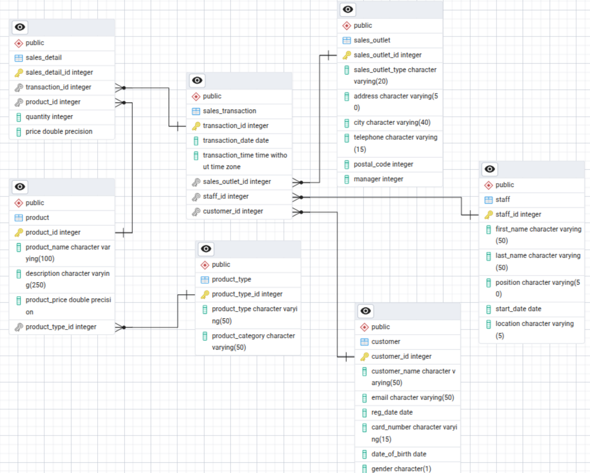

# New York Coffee Database Project

*

**Projet de certification** - IBM Data Engineering Professional Certificate (Coursera)

This project was developed as part of the IBM Data Engineering Professional Certificate on Coursera. It demonstrates hands-on skills in database design, normalization, and multi-database management.

## 📋 Contexte
Projet de migration et centralisation de données pour une chaîne de cafés new-yorkaise en expansion nationale. Transformation d'un système fragmenté (tableurs Excel, CSV, POS) en une base de données relationnelle PostgreSQL professionnelle.

## 🎯 Objectifs
- Centraliser les données opérationnelles et clients
- Concevoir un schéma normalisé pour l'expansion en franchise
- Exporter des sous-ensembles de données vers MySQL pour les partenaires externes (paie, marketing)

## 🛠️ Stack
- **PostgreSQL** : Base principale avec pgAdmin
- **MySQL** : Pour les partenaires externes
- **CSV** : Format d'échange inter-SGBD

## 📊 Fonctionnalités
- Modélisation ERD avec normalisation (7 tables, relations 1:N)
- Vues et vues matérialisées pour l'accès externe
- Migration PostgreSQL → MySQL via CSV
- Données complètes : personnel, points de vente, transactions, clients, produits

*Projet éducatif développé pour valider les compétences du IBM Data Engineering Professional Certificate. Suit une méthodologie professionnelle de conception de bases de données.*

## 📊 Diagramme ERD
